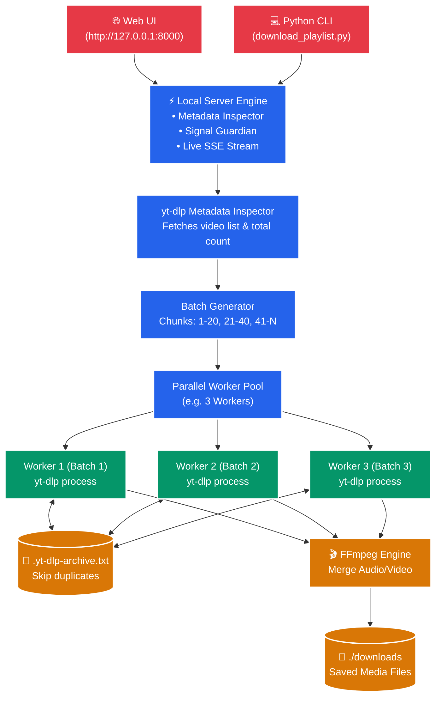

<div align="center">

<!-- Header Banner -->


<!-- Dynamic Animated Typing SVG -->
<a href="#readme">
  
</a>

<br/><br/>

<!-- Shields & Badges -->
[](https://www.python.org/)
[](https://fastapi.tiangolo.com/)
[](https://github.com/yt-dlp/yt-dlp)
[](https://ffmpeg.org/)
[](#prerequisites)
[](#license)

<p align="center">
  <b>A clean, human-friendly YouTube playlist and video downloader running on your local machine with parallel batch downloads, automatic resume, and a clean web UI.</b>
</p>

[🌐 Web Interface](#-local-web-interface) • [💻 CLI Downloader](#-python-cli-downloader) • [⚡ Installation Steps](#-installation-steps) • [🌓 Light & Dark Theme](#-light--dark-mode) • [⚙️ CLI Flags](#-cli-options-reference)

</div>

---

## 🌟 Highlights

| 🔍 Stream Format Inspector | 🎬 10 Containers & Encodings | ⚡ Turbo Speed Engine | 🛡️ Mid-Stream File Salvager |
| :---: | :---: | :---: | :---: |
| <br/>Deep stream analysis displays **actual available resolutions** (4K, 1080p, etc.) with real-time file size calculations | <br/>Select from **10 video & audio formats** (MP4 H.264, AV1, MKV, WebM, MOV, MP3, FLAC, etc.) with interactive hover cards | <br/>**16-fragment concurrency**, 10MB chunking & optional `aria2c` bypasses YouTube player throttling | <br/>Cancelling mid-download? FFmpeg **automatically repairs partial files** so they remain 100% playable |

---

## 🌐 Local Web Interface

Launch the server with one command:

```bash
python app.py
```

Then open **`http://127.0.0.1:8000`** in your browser.

```
┌─────────────────────────────────────────────────────────────────────────────┐
│  ▶ YouTube Downloader   Local Engine      [yt-dlp Ready] [FFmpeg Ready]  ☼/☾ │
├─────────────────────────────────────────────────────────────────────────────┤
│                                                                             │
│  Download YouTube Video or Playlist                                         │
│  Paste any YouTube URL to scan stream formats and download at turbo speed.  │
│                                                                             │
│  [ https://youtube.com/watch?v=jZLHZcyQmJI              ] [Fetch Details]   │
│                                                                             │
│  ┌─ Stream Detected ─────────────────────────────────────────────────────┐  │
│  │ 🎬 Big Buck Bunny 60fps 4K  •  Blender Foundation                     │  │
│  │ 📦 1 Video  •  Type: Single Video  •  Live Thumbnail Preview Loaded   │  │
│  └───────────────────────────────────────────────────────────────────────┘  │
│                                                                             │
│  Available Resolutions (Auto-Detected from Stream):                         │
│  [ 4K Ultra HD (MAX) ]  [ 1440p 2K ]  [ 1080p FHD ★ ]  [ 720p ]  [ Audio ] │
│    ~340 MB (60fps AV1)    ~180 MB       ~95 MB (60fps)   ~45 MB   ~8.5 MB   │
│                                                                             │
│  Output File Type & Encoding:                                               │
│  [ MP4 (H.264 / AAC) — Universal compatibility (Default)                 ▼ ]│
│                                                                             │
│  ┌─ Format Details & Size Estimation ────────────────────────────────────┐  │
│  │ [UNIVERSAL] MP4 (H.264 / AAC)             Estimated Size: ~95 MB      │  │
│  │ Plays on iPhones, Android, TVs, Premiere & DaVinci without recoding.  │  │
│  │ ⚡ Ultra-Fast GPU & Hardware Accelerated • Video: H.264 / Audio: AAC    │  │
│  └───────────────────────────────────────────────────────────────────────┘  │
│                                                                             │
│  Parallel Workers: [ ===●======= ] 3 Workers                                │
│  Batch Size:       [ =====●===== ] 20 Videos / Batch                        │
│                                                                             │
│  [                       ▶ START TURBO DOWNLOAD                          ]  │
│                                                                             │
│  ┌─ Live SSE Download Stream ────────────────────────────────────────────┐  │
│  │ [download] 100% of 95.4MiB at 34.2MB/s ETA 00:00 (16 fragments)       │  │
│  │ [Merger] Merging formats into "downloads/001 - Big Buck Bunny.mp4"    │  │
│  └───────────────────────────────────────────────────────────────────────┘  │
└─────────────────────────────────────────────────────────────────────────────┘
```

### 🌓 Light & Dark Mode
- Built-in theme switch button in the header (Sun / Moon icon).
- Remembers your preference via `localStorage` and respects system defaults.
- Clean high-contrast typography in both modes — no distracting fluorescent glows or unnecessary animations.

---

## ⚡ Turbo Speed Architecture & Optimization Guide

To make single-video and multi-video downloads as fast as physically possible and prevent throttles or data loss, the engine incorporates **10 deep optimizations**:

1. **Elimination of Throttled Rate Loop Traps**:
   YouTube server-side player throttling can cause minor download speed dips. Previous scripts using `--throttled-rate=100K` got stuck in an infinite restart loop (jumping from 10% back to 9%). Removing this threshold maintains continuous stream connection without dropping fragments.
2. **16-Fragment Concurrency (`--concurrent-fragments=16`)**:
   Instead of downloading a single segment at a time, the engine initiates 16 concurrent HTTP connections to YouTube DASH/HLS CDNs simultaneously, saturating full broadband bandwidth.
3. **10MB HTTP Chunk Slicing (`--http-chunk-size=10M`)**:
   Forces yt-dlp to request 10 Megabyte byte-ranges per request rather than tiny chunks, minimizing HTTP handshake latency and round-trip ping penalties.
4. **16MB High-Throughput Memory Buffer (`--buffer-size=16M`)**:
   Allocates a dedicated in-memory ring buffer to prevent disk I/O bottlenecks when writing high-bitrate 4K/60fps streams to SSD/HDD.
5. **Aria2 Multi-Connection Accelerator Auto-Detection**:
   If `aria2c` is installed on your system, the engine automatically delegates downloads with `-s 16 -x 16 -k 1M -j 16`, unleashing multi-threaded parallel downloads.
6. **Parallel Multi-Process Playlist Workers**:
   Playlists are segmented into non-overlapping batches and processed by independent OS worker processes (default 3, up to 8 workers), downloading multiple videos in parallel.
7. **Zero-Transcoding Stream Remuxing**:
   Uses FFmpeg stream-copy (`-c copy`) wherever possible to combine separate video and audio DASH streams instantly without wasting CPU or GPU cycles on re-encoding.
8. **Direct AV1 / VP9 Bitstream Selection**:
   Intelligently selects the native YouTube stream matching your chosen container, preventing any remuxing delays.
9. **Smart Download Archive Resume (`.yt-dlp-archive.txt`)**:
   Tracks downloaded video IDs locally; if an interrupted job is restarted, already downloaded files are skipped instantly in milliseconds.
10. **Zero-Loss Mid-Stream File Salvaging (`salvage_partial_downloads`)**:
    If you stop or cancel a download mid-stream, the engine executes FFmpeg container repair with `-movflags faststart` on the `.part` file, rewriting the MP4 index so you can immediately view and play everything downloaded up to the cancellation point!

---

## 🏗️ How It Works



---

## 📦 Installation Steps

### 1️⃣ Clone the Repository
```bash
git clone https://github.com/adityapatra/Youtube_Download.git
cd Youtube_Download
```

### 2️⃣ Install Python Dependencies
```bash
pip install -r requirements.txt
```
> *(Installs `yt-dlp`, `fastapi`, and `uvicorn`)*

### 3️⃣ Ensure FFmpeg is Installed *(Required for merging video & audio)*

<details open>
<summary><b>🪟 Windows</b></summary>

Install via Windows Package Manager:
```powershell
winget install Gyan.FFmpeg
```
*Or download essentials from [gyan.dev](https://www.gyan.dev/ffmpeg/builds/) and add the `bin` folder to your system PATH.*
</details>

<details>
<summary><b>🐧 Linux (Ubuntu / Debian / Fedora / Arch)</b></summary>

```bash
# Ubuntu / Debian
sudo apt update && sudo apt install -y ffmpeg

# Fedora
sudo dnf install -y ffmpeg

# Arch Linux
sudo pacman -S ffmpeg
```
</details>

<details>
<summary><b>🍎 macOS</b></summary>

```bash
brew install ffmpeg
```
</details>

---

## 🚀 How to Run

### 🌐 Option 1: Web Interface *(Recommended)*

Start the local server:
```bash
python app.py
```
Open **`http://127.0.0.1:8000`** in your browser.

---

### 💻 Option 2: Python CLI Downloader

Run interactively with prompts:
```bash
python download_playlist.py
```

Or pass flags directly:

#### 🎯 Standard Download (1080p, 4 parallel workers, 15 videos/batch)
```bash
python download_playlist.py "https://youtube.com/playlist?list=PL0c0N7xv8s06alYrdpsYjGXBs1IqIU8QS" -o ./downloads -q 1080p -w 4 -c 15
```

#### 🎬 4K Ultra HD Download
```bash
python download_playlist.py "https://youtube.com/playlist?list=PL..." -q 4k -o ./4k_videos
```

#### 🎧 Audio-Only (Extract MP3 with metadata)
```bash
python download_playlist.py "https://youtube.com/playlist?list=PL..." -o ./music --audio-only --audio-format mp3
```

#### 📑 Download Specific Range (Videos 10 to 50)
```bash
python download_playlist.py "https://youtube.com/playlist?list=PL..." --start 10 --end 50
```

#### 🍪 Use Browser Cookies (for Private / Age-Restricted Playlists)
```bash
# Directly extract session from Chrome, Firefox, Brave, or Edge:
python download_playlist.py "https://youtube.com/playlist?list=PL..." --cookies-from-browser chrome

# Or pass an exported cookies file:
python download_playlist.py "https://youtube.com/playlist?list=PL..." --cookies cookies.txt
```

#### 🔍 Dry Run (Inspect playlist and planned batches without downloading)
```bash
python download_playlist.py "https://youtube.com/playlist?list=PL..." --dry-run
```

---

## 📜 CLI Options Reference

| Flag | Type | Default | Description |
|---|---|---|---|
| `url` | Positional | `None` | YouTube playlist or video URL. If omitted, starts interactive wizard. |
| `-o`, `--output` | `str` | `./downloads` | Destination folder for downloaded files. |
| `-q`, `--quality` | `choice` | `1080p` | Quality preset: `best`, `4k`, `1440p`, `1080p`, `720p`, `480p`, `360p`, `audio`. |
| `-f`, `--format` | `str` | `None` | Custom yt-dlp format selector (e.g. `bv*+ba/b`). Overrides `-q`. |
| `--audio-only` | Flag | `False` | Extracts audio stream only. |
| `--audio-format` | `choice` | `m4a` | Audio container format: `m4a`, `mp3`, `opus`, `flac`, `wav`. |
| `-w`, `--workers` | `int` | `3` | Number of simultaneous parallel download workers. |
| `-c`, `--chunk-size` | `int` | `20` | Number of videos per batch chunk. |
| `--start` | `int` | `1` | 1-based start index in playlist. |
| `--end` | `int` | `End` | 1-based end index in playlist. |
| `--cookies` | `path` | `None` | Path to `cookies.txt` file. |
| `--cookies-from-browser` | `choice` | `None` | Extract cookies from browser: `chrome`, `firefox`, `brave`, `edge`, `opera`. |
| `--embed-subs` | Flag | `False` | Download and embed subtitles into video container. |
| `--embed-thumbnail` | Flag | `False` | Embed thumbnail artwork into media file. |
| `--merge-format` | `choice` | `mp4` | Container format for merged video: `mp4`, `mkv`, `webm`. |
| `--retries` | `int` | `10` | Max retries per video on transient network errors. |
| `--no-archive` | Flag | `False` | Disables `.yt-dlp-archive.txt` tracking. |
| `--dry-run` | Flag | `False` | Fetches metadata and displays batch plan without downloading. |
| `-i`, `--interactive` | Flag | `False` | Forces interactive CLI prompt wizard. |

---

## 📂 Project Structure

```text
Youtube_Download/
├── app.py                     # ⚡ Localhost Web Server & API backend
├── download_playlist.py       # 🚀 Python CLI Downloader & parallel batch engine
├── static/                    # 🎨 Clean Web Assets
│   ├── index.html             #    • Clean Single-Page UI with Light/Dark Mode
│   ├── style.css              #    • Human-friendly styles & color palettes
│   └── app.js                 #    • Client controller, theme toggle & SSE logs
├── download_playlist.ps1      # 📜 Original PowerShell script
├── download_playlist_v2.ps1   # 📜 Interactive PowerShell script
├── requirements.txt           # 📦 Dependencies (yt-dlp, fastapi, uvicorn)
├── .gitignore                 # 🙈 Git ignore rules
└── README.md                  # 📖 Documentation
```

---

## 💡 Troubleshooting & FAQ

> [!NOTE]
> **Why do videos skip immediately when I re-run the downloader?**
> By default, the script creates a `.yt-dlp-archive.txt` file in your download directory. It remembers previously downloaded video IDs so you never waste bandwidth re-downloading videos. To force re-downloading, delete that file or pass `--no-archive`.

> [!TIP]
> **How to get the highest download speed?**
> Increase the workers count with `-w 4` or `-w 6` and adjust chunk size with `-c 15`. You can also tweak `--concurrent-fragments 5` for rapid fragment fetching.

> [!IMPORTANT]
> **Getting "ffmpeg is not recognized" error?**
> Ensure `ffmpeg` is installed and accessible in your system `PATH`. Restart your terminal or command prompt after installing.

---

<div align="center">

<!-- Footer Wave -->


<p><b>Crafted for fast, reliable YouTube playlist downloading.</b></p>
<p>⭐ Star this repository if it helped you!</p>

</div>
